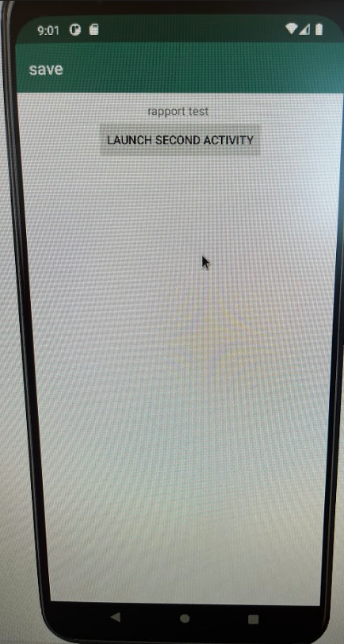
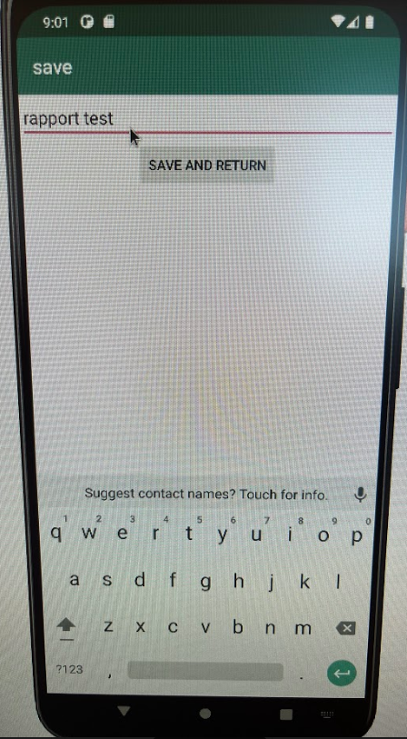

# Rapport

1.  Add textview and button at activity_main.xml file. 
    Textview used to show text from shared preference. 
    Button used to start second activity. 
```
<TextView
        android:id="@+id/prefText"
        android:layout_width="wrap_content"
        android:layout_height="wrap_content"
        android:text="Pref"
        android:layout_marginTop="10dp"
        android:layout_gravity="center"
        app:layout_constraintEnd_toEndOf="parent"
        app:layout_constraintStart_toStartOf="parent"
        app:layout_constraintTop_toBottomOf="@+id/appBarLayout"/>

    <Button
        android:id="@+id/start_button"
        android:layout_width="wrap_content"
        android:layout_height="wrap_content"
        android:text="Launch Second activity"
        app:layout_constraintEnd_toEndOf="parent"
        app:layout_constraintStart_toStartOf="parent"
        app:layout_constraintTop_toBottomOf="@+id/prefText"/>

```
2.  Add SecondActivity.java file and activity_second.xml layout file.
    Add EditText and Button at layout file. 
    Edittext view is used to write some word. Button is used to do function onclick().
```
<EditText
        android:id="@+id/settingseditview"
        android:layout_width="match_parent"
        android:layout_height="wrap_content"
        android:layout_marginTop="10dp"
        app:layout_constraintEnd_toEndOf="parent"
        app:layout_constraintStart_toStartOf="parent"
        />
    <Button
        android:id="@+id/save_button"
        android:layout_width="wrap_content"
        android:layout_height="wrap_content"
        android:text="Save and return"
        app:layout_constraintEnd_toEndOf="parent"
        app:layout_constraintStart_toStartOf="parent"
        app:layout_constraintTop_toBottomOf="@+id/settingseditview" />
```
3. Add code about shared preference at second activity.    
   Add shared preference code and button function code.
   Code is used to save the word to shared preference and close this activity.
```
        myPreferenceRef = getSharedPreferences("MyPreferencesName", MODE_PRIVATE);
        myPreferenceEditor = myPreferenceRef.edit();

        saveButton =  findViewById(R.id.save_button);
        saveButton.setOnClickListener(new View.OnClickListener() {
            @Override
            public void onClick(View view) {
                onButtonClick();
            }
            
       private void onButtonClick(){
        editView = findViewById(R.id.settingseditview);
        myPreferenceEditor.putString("MyAppPreferenceString",editView.getText().toString());
        myPreferenceEditor.apply();
        finish();
    }
```
4.  Add code at button about launch second activity in the MainActivity.java.
```
        startButton = findViewById(R.id.start_button);
        startButton.setOnClickListener(new View.OnClickListener() {
            @Override
            public void onClick(View view) {
                onButtonClick();
            }
        });
        
        private void onButtonClick(){
            Intent intent = new Intent(this,SecondActivity.class);
            startActivity(intent);
        }
```
5.  Add a new function onResuem() at MainActivity.java. Add some code in the function.
    Function can get the word from SecondActivity by using shared preference.
```
    protected void onResume() {
        super.onResume();
       
        myPreferenceRef = getSharedPreferences("MyPreferencesName", MODE_PRIVATE);
        prefTextRef=findViewById(R.id.prefText);
        prefTextRef.setText(myPreferenceRef.getString("MyAppPreferenceString", "No preference found."));
    }
```

Bilder





